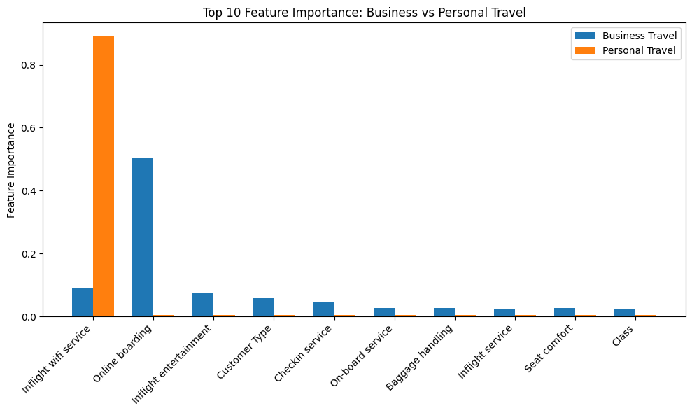
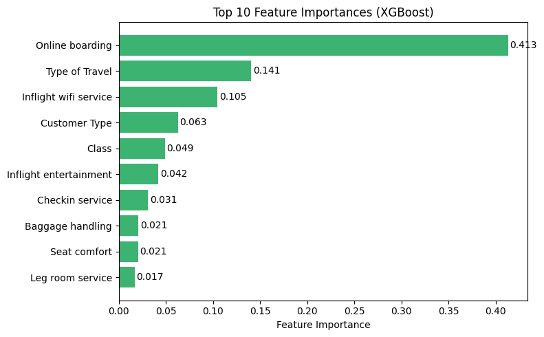
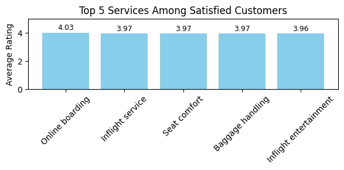

# Airline Passenger Satisfaction — ML Classification

**Can we predict whether an airline passenger will be satisfied or dissatisfied?**  
This project applies seven machine learning models to a 103,000+ passenger survey dataset to identify the key drivers of satisfaction and build a reliable prediction tool.

---

## Project Overview

| | |
|---|---|
| **Dataset** | 103,904 airline passenger survey responses (Kaggle) |
| **Target variable** | `satisfaction` (Satisfied / Neutral or Dissatisfied) |
| **Class split** | 43.3% satisfied, 56.7% neutral/dissatisfied |
| **Models** | Naive Bayes, Logistic Regression, Decision Tree, XGBoost, Random Forest, ANN, SVM |
| **Best accuracy** | **96.50% (Random Forest)** |
| **Tools** | Python, scikit-learn, XGBoost, TensorFlow/Keras, statsmodels |

---

## Key Visualisations

### Feature Importance: Business vs Personal Travel


*Online boarding dominates satisfaction for business travellers; inflight Wi-Fi is the single strongest predictor for personal travellers.*

### XGBoost Top 10 Feature Importances


*Online boarding (0.413) and Type of Travel (0.141) are the two most predictive features overall.*

### Top 5 Services Among Satisfied Customers


*Satisfied customers consistently rate online boarding, inflight service, seat comfort, baggage handling, and entertainment highest.*

---

## Model Performance Summary

| Model | Accuracy | Notes |
|---|---|---|
| **Random Forest** | **96.50%** | Best overall; strong generalisation |
| **XGBoost** | 96.27% | Fast on large data; lower interpretability |
| **ANN** | ~95%+ | Handles non-linear patterns well |
| **SVM** | ~94%+ | Solid; computationally expensive |
| **Decision Tree** | ~88%+ | Interpretable; prone to overfitting |
| **Logistic Regression** | ~87%+ | Simple; good baseline |
| **Naive Bayes** | ~85%+ | Fast; assumes feature independence |

---

## Key Findings

- 🛜 **Inflight Wi-Fi** — strongest predictor for personal travellers
- 🖥️ **Online boarding** — dominant driver for business travellers and overall (XGBoost: 0.413 importance)
- 🪑 **Seat comfort & inflight service** — consistently top-rated among satisfied customers
- 💼 **Business travellers** are significantly more satisfied than personal travellers
- 🎯 **Marginal passengers** (ratings 2–4) represent the highest conversion opportunity

**Business recommendations:**
1. Prioritise online boarding and Wi-Fi upgrades — highest ROI on satisfaction
2. Apply the **Peak-End Rule** — optimise the final moments of the journey disproportionately
3. Target mid-satisfaction passengers with lightweight interventions (loyalty points, targeted surveys)

---

## Notebook Structure

```
1. Introduction & Business Understanding
2. Data Understanding (EDA)
3. Model Applying
   ├── Naive Bayes
   ├── Logistic Regression + K-Means clustering
   ├── Decision Tree + XGBoost
   ├── Random Forest (best model)
   ├── ANN + feature importance
   └── SVM
4. Conclusion & Business Insights
```

---

## How to Run

**1. Download data from Kaggle:**  
[Airline Passenger Satisfaction Dataset](https://www.kaggle.com/datasets/teejmahal20/airline-passenger-satisfaction) → place `train.csv` and `test.csv` in `data/`

**2. Install dependencies:**
```bash
pip install pandas numpy matplotlib seaborn scikit-learn xgboost tensorflow category_encoders statsmodels
```

**3. Run the notebook:**
```bash
jupyter notebook airline_passenger_satisfaction.ipynb
```

---

## Academic Context

Group project for **INFS5720**, UNSW Sydney (2025).  
Contributors: Yunwei Xu, Fan Wu, Xi Lu, Jiashen Zhou, Xinyi Li.  
Data: [Kaggle — TJ Klein](https://www.kaggle.com/datasets/teejmahal20/airline-passenger-satisfaction)

---

*Xi Lu (Lucy) — UNSW Master of Commerce (Marketing & Business Analytics), 2026*
